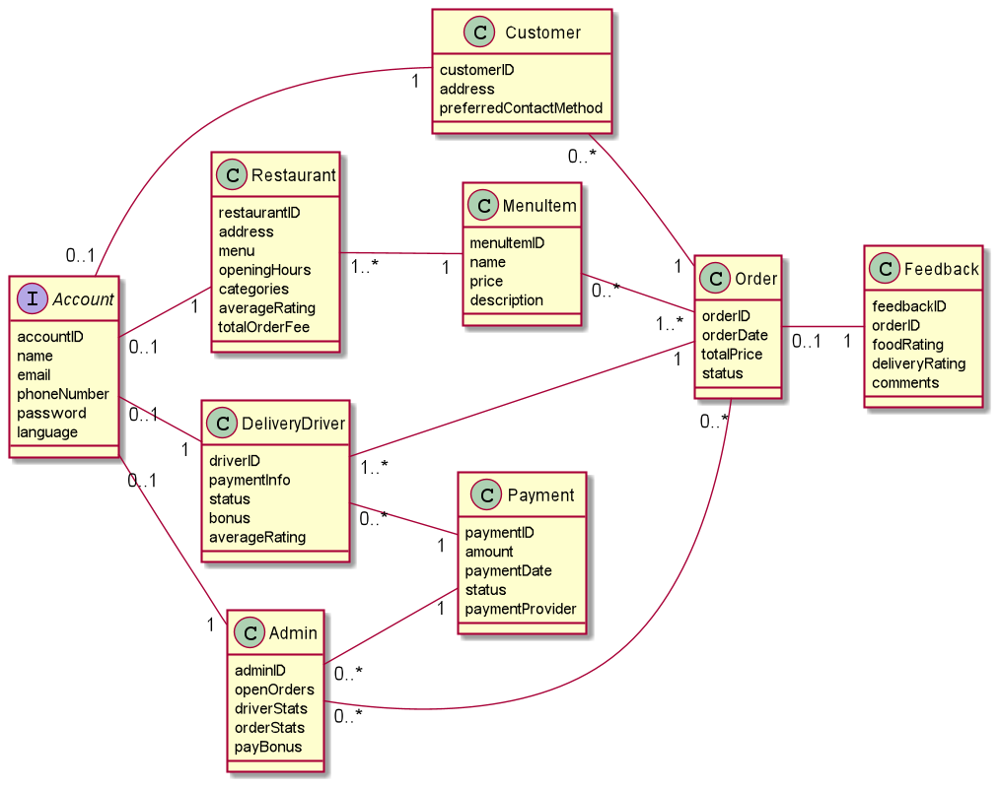
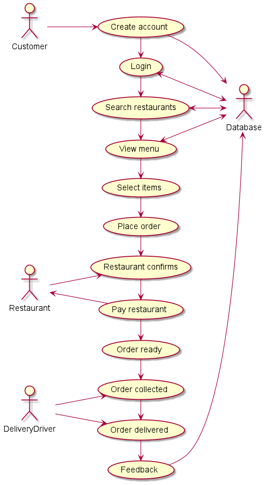
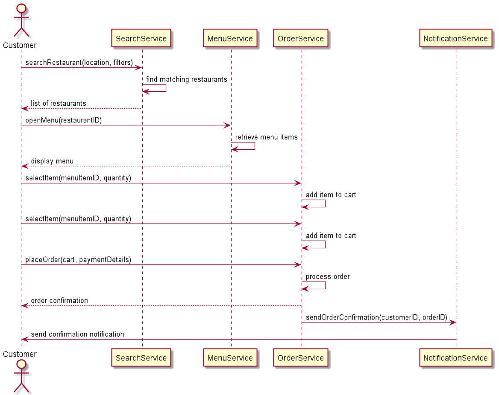

### User Stories and Acceptance Criteria

#### Customer

As a customer I want to be able to create an account so that I can save my details and order food quickly in the future.

Acceptance Criteria:

1. The system should require the customer to enter a valid email, password and phone number to create an account.

2. The password must be at least 8 characters long and include at least one number.

As a customer I want to log in so that I can access my account.

Acceptance Criteria:

1. The login page should require an email or phone number and password.

2. If the login is unsuccessful, an error message “Invalid email/phone number or password” should be displayed.

As a customer I want to be able to search for restaurants by name, area and categories.

Acceptance Criteria:

1. The search feature should allow searching by name, area, and category.

2. Results should be displayed within 2 seconds.

As a customer I want to be able to view a menu for a restaurant so that I can place an order.

Acceptance Criteria:

1. Menu items should be displayed with a name and price.

2. Customers should be able to add menu items to their order.

As a customer I want to place an order so that the food can be delivered to me.

Acceptance Criteria:

1. The order should show a total price of all items.

As a customer I want to receive notifications so that I know when it has arrived.

Acceptance Criteria:

1. The customer should receive a notification via SMS or app to confirm delivery

As a customer I want to rate the food and delivery so that I can provide feedback to improve my experience.

Acceptance Criteria:

1. Ratings should be on a 1-5 scale for food and delivery.

2. A customer should be able to leave a comment up to 250 characters.

#### Restaurant

As a restaurant I want to be able to create an account so that customers can order from from the restaurant.

Acceptance Criteria:

1. The system should require the restaurant's name, address, menu and a password to create an account.

As a restaurant I want to be able to edit my menu so that it is up to date.

Acceptance Criteria:

1. The system should allow restaurants to add, edit, or delete items from their menu.

2. Each menu item should include a name and price.

As a restaurant I want to be able to set my opening hours so that customers know when we are open.

Acceptance Criteria:

1. Orders should only be allowed if the restaurant is open.

2. Opening hours should be displayed when choosing the restaurant.

As a restaurant I want to be able to choose categories so that customers know the type of food I serve.

Acceptance Criteria:

1. The system should allow the restaurant to select from predefined categories.

As a restaurant I want to recieve notifications (via SMS or app) so that I know a customer has placed an order.

Acceptance Criteria:

1. Notification should include the order details.

2. There should be a button to click when the order is ready to be delivered.

As a restaurant I want to see a breakdown of MTOGO's fees so that I can understand the fee.

Acceptance Criteria:

1. The system should display a clear breakdown of fees based on total orders.

#### Delivery Driver

As a delivery driver I want to be able to create an account so that deliver food to customers.

Acceptance Criteria:

1. The system should require the delivery driver's name, email, phone number, payment information and a password to create an account.

As a delivery driver I want to recieve notifications (via SMS or app) so that I know a delivery is available.

Acceptance Criteria:

1. The driver should receive a notification with order details.

2. If the driver does not accept the delivery it should be reassigned to another driver.

As a delivery driver I want to see details about the delivery so that I know where to pick it up and where to deliver it.

Acceptance Criteria:

1. Delivery details should include pickup and drop-off addresses and customer contact information.

As a delivery driver I want to be able to mark the order as finished so that the customers knows it has been delivered.

Acceptance Criteria:

1. The driver should have a “Mark as Delivered” button that notifies the customer.

As a delivery driver I want to recieve a payment confirmation so that I know how much I have earned.

Acceptance Criteria:

1. There should be a page on the app where a delivery driver can check their earnings.

#### Admin

As a admin I want to see stats of the delivery driver so that I can calcute their bonus.

Acceptance Criteria:

1. Admin should see a dashboard of each driver's total deliveries, average ratings and working hours for the week.

2. The system should automatically calculate bonuses.

As a admin I want to see the status of all orders so that I can solve any potential issue.

Acceptance Criteria:

1. Admin should have real-time access to an order status dashboard showing all open and completed orders.

### Domain Model

### Use Case Diagram

### Sequence Diagram

